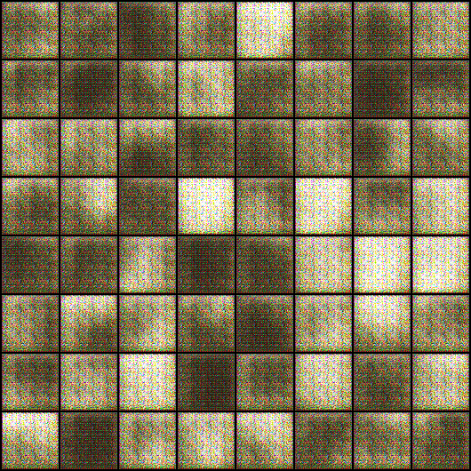
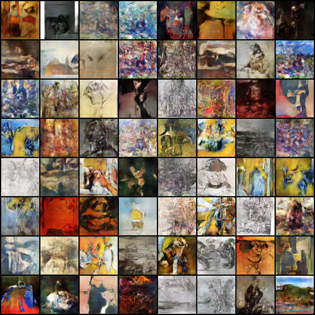

# ARTGAN
This project on "ARTGAN" is a simple generative adversarial network-based on art images using deep learning &; PyTorch.
Generative Adversarial Networks, or GANs for short, are an approach to generative modeling using deep learning methods, such as convolutional neural networks.
In the gans_training file, we can view the improvement of the generative network.

Generative modeling is an unsupervised learning task in machine learning that involves automatically discovering and learning the regularities or patterns in input data in such a way that the model can be used to generate or output new examples that plausibly could have been drawn from the original dataset.

GANs are a clever way of training a generative model by framing the problem as a supervised learning problem with two sub-models,the first one is generator model by which we can train to generate new examples and the second one is discriminator model by which we can classify the examples as real (from the domain) or fake (generated). The two models are trained together in a zero-sum game, adversarial, until the discriminator model is fooled about half the time, meaning the generator model is generating plausible examples.

GANs are an exciting and rapidly changing field, delivering on the promise of generative models in their ability to generate realistic examples across a range of problem domains, most notably in image-to-image translation tasks such as translating photos of summer to winter or day to night, and in generating photorealistic photos of objects, scenes, and people that even humans cannot tell are fake.

Dataset
----

GAN Architecture:
----

    
  

 
Result:
----

**generated-images-01**

**generated-images-030**

**generated-images-0200**

**generated-images-0300**

Video for showing improvement Generator
----

[Link to video](https://github.com/soham2707/ARTGAN/blob/master/art_gans_training.avi)

Conclusion
----
Here we are seeing that the fake pictures quality is good but fake images prediction values are not very good.So now again we can run it using lower learning rate(lr) and near about 80-100 epoches may be able to increase the fake images prediction value.

Blog
----

Check out my Medium article ,where I have explained in detail.

[Link to blog](https://nandisoham2017.medium.com/artgan-a-b77ecb1bc25a)

